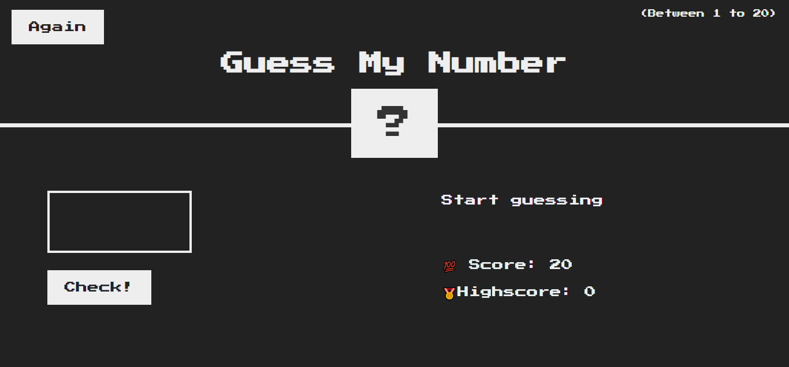
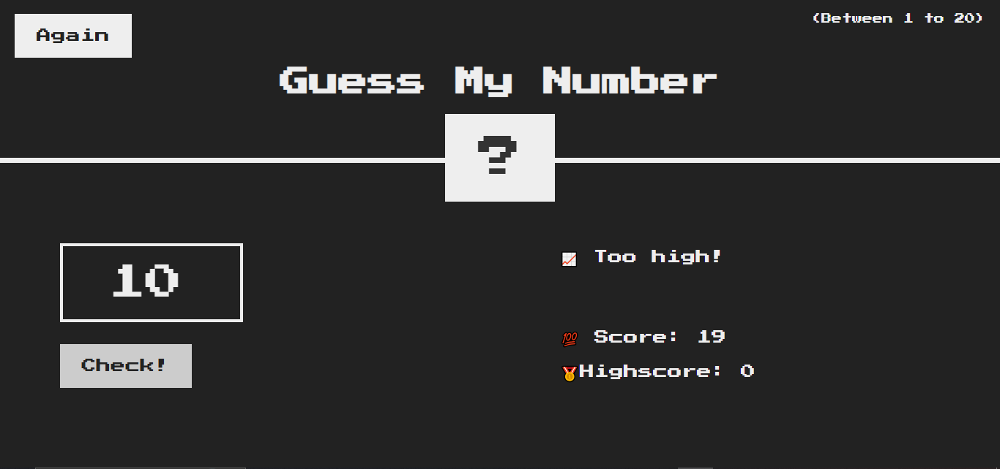
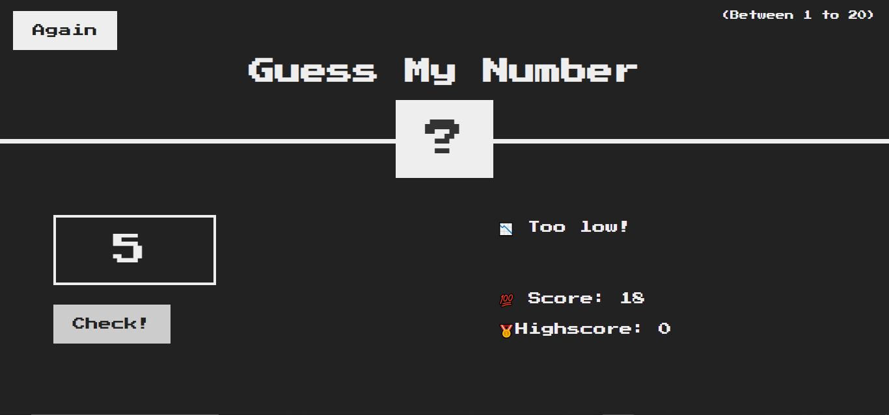
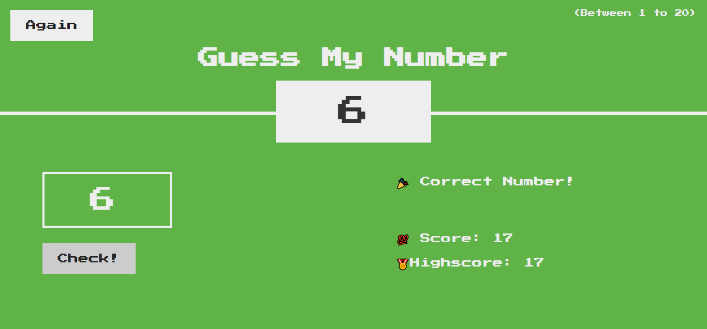
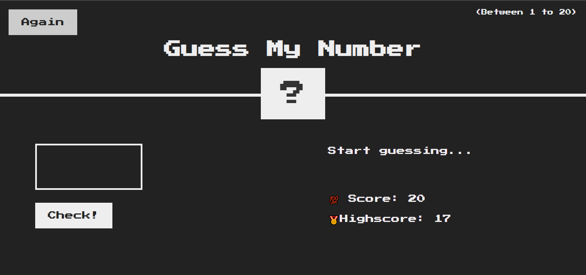

# Guess My Number - A Simple JavaScript Game

Guess My Number" is a fun number-guessing game built using HTML, CSS, and JavaScript. The player tries to guess the secret number between 1 and 20 with limited attempts.

## Features

- Random number generation
- Input validation
- Score tracking
- Reset functionality

## Installation

Just download or clone the repository and open the index.html file in your browser.

## Screenshots

[Guess My Number Screenshots]

## Tech Stack

- HTML
- CSS
- JavaScript
